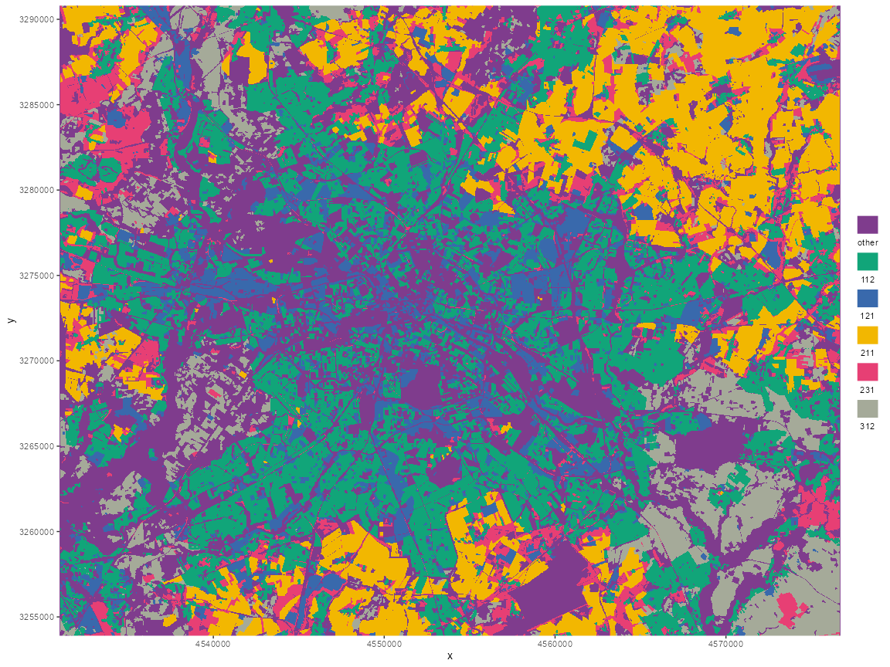

<!-- README.md is generated from README.Rmd. Please edit that file -->

# d6geodata </a>

<!-- badges: start -->
<!-- badges: end -->

> The `d6geodata` package aims to provide spatial data for the
> ‘Ecological Dynamics’ Department of the IZW. The data sets are
> seperated in raw and processed data from different geographical
> regions like Germany and Berlin. Two main functions for accessing the
> data from the PopDynCloud and three plotting functions to visualize
> the raster data. Several additional functions are included but meant
> for the Geodatamanager to provide the datasets.

<br>

# 

<br>

## Installation

You can install the `d6geodata` package from GitHub:

``` r
install.packages("devtools")
devtools::install_github("EcoDynIZW/d6geodata")
```

(Note: If you are asked if you want to update other packages either
press “No” (option 3) and continue or update the packages before running
the install command again.)

Afterwards, load the functionality and data of the package in each
session:

``` r
library(d6geodata)
```

<br>

# Accessing Geodata

If you want to get geodata we already have in our Geodata archive you
have two options: go on the EcoDyn Website, click on wikis and select
[Geodata](https://ecodynizw.github.io/geodata.html). There you’ll find
several raster layers and vector data with plots and metadata. In the
metadata section, you’ll find the folder_name. You can copy this and use
this together with `get_geodata()` function to get the data from our
PopDynCloud. Another option is the function called `geo_overview()`.
There you can select which data and from which location you want to have
a list of data.

If you run the function `geo_overview` you have to decide if you want to
see the raw or processed data by typing 1 for raw and 2 for processed
data. Afterwards, you have to decide if you want to see the main
(type 1) folders (the regions or sub-regions we have data from) or the
sub (type 2) folders (the actually data we have in each region).

<br>

#### Example 1: main folder

``` r
d6geodata::geo_overview(path_to_cloud = "E:/PopDynCloud")
Raw or processed data: 

1: raw
2: processed

Auswahl: 2
choose folder type: 

1: main
2: sub

Auswahl: 1
[1] "atlas" "BB_MV_B" "berlin" "europe" "germany" "world"
```

#### Example 2: sub folder

``` r

d6geodata::geo_overview(path_to_cloud = "E:/PopDynCloud")
Raw or processed data: 

1: raw
2: processed

Auswahl: 2
choose folder type: 

1: main
2: sub

Auswahl: 2
$atlas
[1] "distance-to-human-settlements_atlas_2009_1m_03035_tif"
[2] "distance-to-kettleholes_atlas_2022_1m_03035_tif"      
[3] "distance-to-rivers_atlas_2009_1m_03035_tif"           
[4] "distance-to-streets_atlas_2022_1m_03035_tif"          
[5] "landuse_atlas_2009_1m_03035_tif"                      

$BB_MV_B
[1] "_archive" "_old_not_verified" "dist_path_bb_agroscapelabs"
[4] "scripts"                   

$berlin
 [1] "_old_not_verified"                            
 [2] "corine_berlin_2015_20m_03035_tif"            
 [3] "distance-to-paths_berlin_2022_100m_03035_tif" 
 [4]  "green-capacity_berlin_2020_10m_03035_tif"    
 [5] "imperviousness_berlin_2018_10m_03035_tif"     
 [6]  "light-pollution_berlin_2021_100m_03035_tif"  
 [7] "light-pollution_berlin_2021_10m_03035_tif"    
 [8]  "motorways_berlin_2022_100m_03035_tif"        
 [9] "noise-day-night_berlin_2017_10m_03035_tif"    
[10]  "population-density_berlin_2019_10m_03035_tif"
[11] "template-raster_berlin_2018_10m_03035_tif"    
[12] "tree-cover-density_berlin_2018_10m_03035_tif"

$europe
[1] "imperviousness_europe_2018_10m_03035_tif"

$germany
 [1] "_old_not_verified"                                          
 [2] "distance-to-motorway-rural-road_germany_2022_100m_03035_tif"
 [3] "distance-to-motorways_germany_2022_100m_03035_tif"          
 [4] "distance-to-paths_germany_2022_100m_03035_tif"              
 [5] "distance-to-roads-paths_germany_2022_100m_03035_tif"        
 [6] "distance-to-roads_germany_2022_100m_03035_tif"              
 [7] "distance_to_paths_germany_2022_100m_03035_tif"              
 [8] "motoroways_germany_2022_03035_osm_tif"                      
 [9] "motorway-rural-road_germany_2022_100m_03035_tif"            
[10] "motorways_germany_2022_100m_03035_tif"                      
[11] "paths_germany_2022_100m_03035_tif"                          
[12] "Roads-germany_2022_100m_03035_tif"                          
[13] "roads_germany_2022_100m_03035_tif"                          
[14] "tree-cover-density_germany_2015_100m_03035_tif"             

$world
character(0)
```

Now you can copy the name of one of the layers and paste it into the
get_geodata function

``` r
corine <-
  d6geodata::get_geodata(
    data_name = "corine_berlin_2015_20m_03035_tif",
    path_to_cloud = "E:/PopDynCloud",
    download_data = FALSE
  )
```

If you set download_data = TRUE the data will be download and copied to
your data-raw folder. If the data-raw folder doesn’t exist, it will
create one.

# Plotting functions

The three functions `plot_binary_map()`, `plot_qualitative_map()` and
plot `plot_quantitative_map()` can be used to plot raster data with the
respective color sceams we used for the Geodata wiki page, but for
raster data only!

``` r
plot_binary_map(tif = tif)
plot_qualitative_map(tif = tif)
plot_quantitative_map(tif = tif)
```

#### Example plot

``` r
library(d6geodata)
plot_qualitative_map(tif = corine)
```



<br>

# 

<details>
<summary>
Session Info
</summary>

``` r
Sys.time()
#> [1] "2023-03-02 11:55:26 CET"
git2r::repository()
#> Local:    main C:/Users/wenzler/Documents/GitHub/d6geodata
#> Remote:   main @ origin (https://github.com/EcoDynIZW/d6geodata.git)
#> Head:     [bc52b78] 2023-02-16: small change for labels
sessionInfo()
#> R version 4.2.2 (2022-10-31 ucrt)
#> Platform: x86_64-w64-mingw32/x64 (64-bit)
#> Running under: Windows 10 x64 (build 17763)
#> 
#> Matrix products: default
#> 
#> locale:
#> [1] LC_COLLATE=German_Germany.1252  LC_CTYPE=German_Germany.1252   
#> [3] LC_MONETARY=German_Germany.1252 LC_NUMERIC=C                   
#> [5] LC_TIME=German_Germany.1252    
#> 
#> attached base packages:
#> [1] stats     graphics  grDevices utils     datasets  methods   base     
#> 
#> other attached packages:
#> [1] d6geodata_0.0.0.9000
#> 
#> loaded via a namespace (and not attached):
#>  [1] tidyselect_1.2.0   terra_1.7-3        xfun_0.36          sf_1.0-9          
#>  [5] colorspace_2.1-0   vctrs_0.5.2        generics_0.1.3     htmltools_0.5.4   
#>  [9] stars_0.6-0        yaml_2.3.6         utf8_1.2.3         rlang_1.0.6       
#> [13] e1071_1.7-13       pillar_1.8.1       glue_1.6.2         withr_2.5.0       
#> [17] DBI_1.1.3          lifecycle_1.0.3    stringr_1.5.0      munsell_0.5.0     
#> [21] gtable_0.3.1       ragg_1.2.5         codetools_0.2-18   evaluate_0.20     
#> [25] knitr_1.42         fastmap_1.1.0      parallel_4.2.2     class_7.3-20      
#> [29] fansi_1.0.4        highr_0.10         Rcpp_1.0.10        KernSmooth_2.23-20
#> [33] scales_1.2.1       classInt_0.4-8     lwgeom_0.2-11      abind_1.4-5       
#> [37] farver_2.1.1       systemfonts_1.0.4  textshaping_0.3.6  ggplot2_3.4.1     
#> [41] digest_0.6.31      stringi_1.7.12     dplyr_1.1.0        grid_4.2.2        
#> [45] cli_3.6.0          tools_4.2.2        magrittr_2.0.3     proxy_0.4-27      
#> [49] tibble_3.1.8       rcartocolor_2.0.0  pkgconfig_2.0.3    rmarkdown_2.20    
#> [53] rstudioapi_0.14    R6_2.5.1           units_0.8-1        compiler_4.2.2    
#> [57] git2r_0.31.0
```

</details>

------------------------------------------------------------------------

<br>

#### Attribution-NonCommercial-ShareAlike 4.0 International (CC BY-NC-SA 4.0)

<div style="width:300px; height:200px">


</div>
